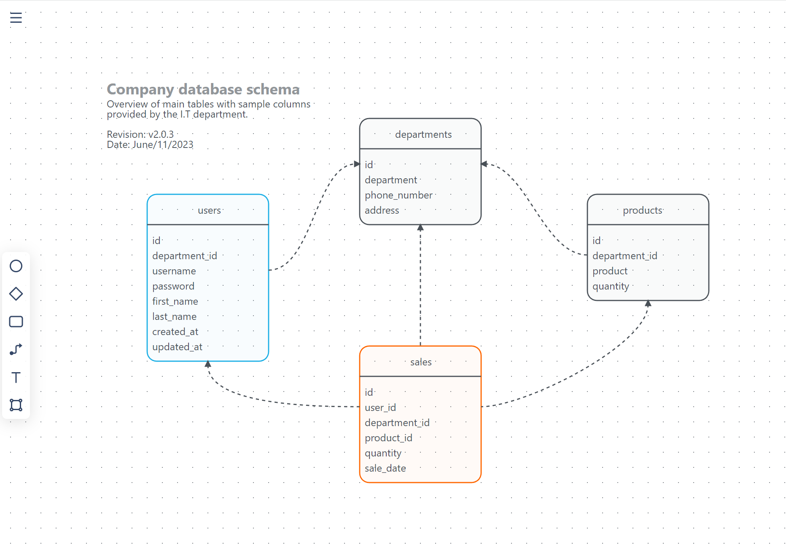

# Diagram editor

Simple diagram editor

## Installation

Install dependencies
```bash
shards install
```
Compile
```bash
crystal build src/diagram.cr --release
```

Execute
```bash
./diagram
```

## Screenshots
https://diagram.mischicanadas.com/?k=202306b5589bb8


## Contributing

1. Fork it (<https://github.com/xtokio/diagram/fork>)
2. Create your feature branch (`git checkout -b my-new-feature`)
3. Commit your changes (`git commit -am 'Add some feature'`)
4. Push to the branch (`git push origin my-new-feature`)
5. Create a new Pull Request

## Contributors

- [AlexeyBoiko](https://github.com/AlexeyBoiko) - Creator and maintainer of project [DgrmJS](https://github.com/AlexeyBoiko/DgrmJS)
